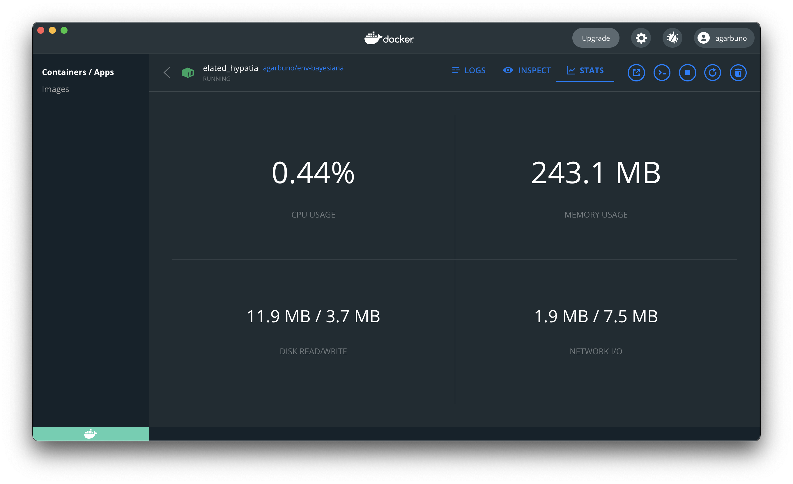
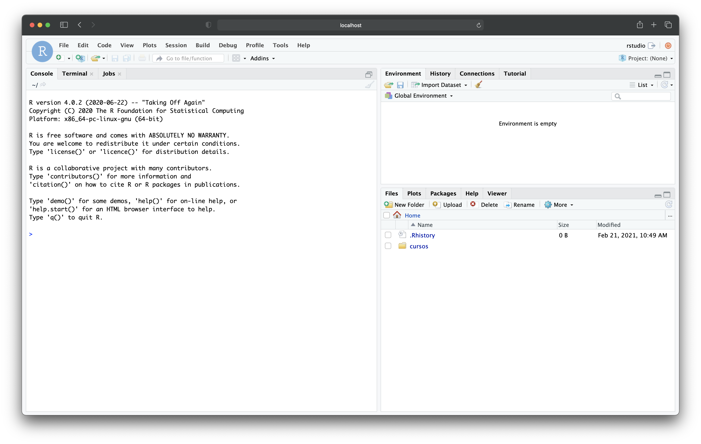

# Aprendizaje Estadístico

Notas para el curso de licenciatura de Aprendizaje Estadístico (EST-25134). 

## Requisitos de ambiente: 

- El código se puede correr utilizando una versión reciente$^\star$ de `R` (4.0.2). 
- Se utiliza `Rstudio` para mantener un ambiente de trabajo estandarizado. 
- El paquete `renv` nos sirve para mantener las librerías funcionando y replicando el ambiente de trabajo en el que fueron diseñado el código de apoyo. 
- Si estás interesada en mantenerte al tanto de las paqueterías base del curso puedes consultar: 
  - [libro `caret`](http://appliedpredictivemodeling.com/)
  - [libro `tidyverse`](https://www.tidyverse.org/learn/)
  - [libro `tidymodels`](https://www.tmwr.org/)
  - [blog `parsnip`](https://www.tidyverse.org/blog/2018/11/parsnip-0-0-1/)
  - [video `tidymodels`](https://www.youtube.com/watch?v=sMdcjHNBsZM&t=606s)
  - [video: _search strategies in cross validation_](https://www.youtube.com/watch?v=qEeF-ErtUAU)
  - [video: _tuning_](https://rstudio.com/resources/rstudioconf-2020/total-tidy-tuning-techniques/)

## Preparando el ambiente de trabajo: 

Para garantizar que tengas todos los paquetes necesarios utiliza el comando siguiente **una vez que hayas abierto** el repositorio como un proyecto en `Rstudio`: 

```{R}
renv:restore()
```

*NOTA:* esta última instrucción puede tarda alrededor de una hora pues tiene que instalar y compilar la mayoría de los paquetes que se utilizan para el material de apoyo. 

## Ambiente _dockerizado_

Parte del curso utiliza material de apoyo que se encuentra en `codigo/` de este mismo repositorio.

Por cuestiones de reproducibilidad, didáctica, y para poder practicar el uso de [Docker](https://www.docker.com/get-started), se ha creado un imagen con lo necesario para poder compilar notas.<a href="#note1" id="note1ref"><sup>1</sup></a> 

Para poder utilizar la imagen primero asegurate de tener instalado en tu computador Docker o DockerHub y en terminal (la documentación de Docker debería de poder guiarte en utilizar la interfaz gráfica con el mismo propósito) ejecuta lo siguiente:

```{bash}
docker pull agarbuno/env-statistical
```

que es una imagen configurada con este [Dockerfile](https://github.com/agarbuno/dockerfiles/blob/master/env-bayesiana/Dockerfile). 

Para poder iniciar la aplicación ejecuta en línea de comandos, o a través de un `shell script`, lo siguiente:

```{bash}
RENV_PATHS_CACHE_CONTAINER=/home/rstudio/.local/share/renv/cache/
RENV_PATHS_CACHE_HOST={ruta en tu máquina donde guardarás el cache de renv}/renv/cache
PATH_GIT_CURSOS={ruta en tu máquina donde tienes clonado el repo o tu fork de la clase}

docker run -p 8787:8787 \
    -e PASSWORD={password que tu escojas} \
    -e "RENV_PATHS_CACHE=${RENV_PATHS_CACHE_CONTAINER}" \
    -e "RENV_PATHS_ROOT=${RENV_PATHS_CACHE_CONTAINER}" \
    -v "${RENV_PATHS_CACHE_HOST}:${RENV_PATHS_CACHE_CONTAINER}" \
    -m 8g \
    -v "${PATH_GIT_CURSOS}:/home/rstudio/cursos" \
    agarbuno/env-bayesiana
```

Si la aplicación fue exitosa la podrás ver corriendo en el _Dashboard_ de Docker 



o en terminal verás el siguiente mensaje 

```{bash}
    [s6-init] making user provided files available at /var/run/s6/etc...exited 0.
    [s6-init] ensuring user provided files have correct perms...exited 0.
    [fix-attrs.d] applying ownership & permissions fixes...
    [fix-attrs.d] done.
    [cont-init.d] executing container initialization scripts...
    [cont-init.d] userconf: executing...
    [cont-init.d] userconf: exited 0.
    [cont-init.d] done.
    [services.d] starting services
    [services.d] done.
```

Mejor aún, podrás accesar al servidor de `Rstudio` en tu navegador en la ruta: `localhost:8787/`. Para esto las credenciales que necesitarás serán el usuario `rstudio` y la contraseña que estableciste arriba. 



Si has seguido las instrucciones como vienen en este documento. El repositorio de estas notas lo veras en la sesión del `Rstudio` en la ruta `/home/rstudio/cursos/`. Todos los cambios que hagas en esta ruta se verán reflejados en la ruta de tu máquina (HOST) que habíamos definido en la variable de sistema `PATH_GIT_CURSOS`. De esta forma tendrás un ambiente de trabajo homologado cuyo principio es: 

1. El sistema operativo y el ambiente de trabajo se encuentra en una máquina virtual base (la imagen de Docker).
2. Los archivos y tu registro de trabajo (cambios, nuevos scripts, etc.) los tienes guardados en fisico en tu máquina (HOST). 

*NOTA:* si decides utilizar el ambiente _dockerizado_ se sugiere cambiar a otra rama dentro del repositorio pues la dupla `Docker` y `renv` marcarán el origen de los paquetes como `RSPM` en lugar de `CRAN`. Puedes usar la siguiente instrucción, por ejemplo, en la línea de comandos: 

```{bash}
git checkout -b docker-run
```

Para mantener esta rama en particular al corriente con el desarrollo del material deberás hacer un _merge_ de la rama principal a la rama de _Docker_:

```{bash}
git checkout -b docker-run
git fetch 
git merge origin/master
```

Por último podría ser el caso que necesites resolver conflictos en el _merge_ con la rama `master`. Para esto puedes utilizar un editor de texto (como [`Atom`](https://atom.io/))o el mismo ambiente de `Rstudio`.

#### Observaciones:

<a id="note1" href="#note1ref"><sup>1</sup></a>El formato de las notas que se puede reproducir con esto es `bookdown::gitbook`. La compatibilidad con `bookdown::pdf_book` aun no es reproducible.

